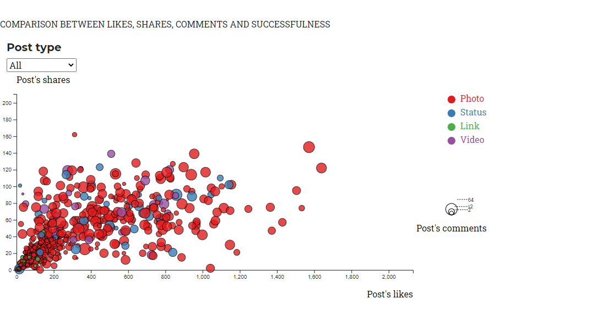

# WELCOME TO POSTS*METER! 
*A Machine Learning social media posts evaluator app*
 

 

# PUZZLED MEDIA ANALYTICS.INC 
## *"Your challenge become our Mission"*

 

## `Measure social media impact on your brand building, by consulting the best campaign post success meter!`

 
 

---
 

## TEAM EXPERTS

### Adriana Avalos  

### Laura Torres  

### Pamela Hernandez  

### Clemente Sanchez  

### Gabby Olivares  

 
 

---

## Background

The increase of internet users has favored customers to exchange ideas and feedback about products and services.

The potential usage of internet-based social networks to influence customers towards brand awareness and brand engagement, has pushed marketing managers to incorporate social media marketing communication in their key metric strategies and KPI's. 

Social media publications are highly related to brand building and brand recognition and the higher the level of  engagement and interaction in any action or any parameter, the most important the feature to build brand awareness and brand recognition.  

* Brand recognition: is the extent to which the public can identify your brand from its visual symbols and products (main metrics: brand impressions, brand image, brand identity, brand positioning). 

 

* Brand awareness goes a step further to the point that the public can recall information, emotions or general impressions about your brand (main metrics: top of mind, perceptual maps).

Both, are steps that customer takes on the path to a purchase or becoming a loyal brand advocate.

[Branding facts, Mexico](https://simplicable.com/new/brand-recognition-vs-brand-awareness#:~:text=Brand%20recognition%20is%20the%20extent,general%20impressions%20about%20your%20brand.)

 

##### MAIN COUNTRIES WITH THE MOST FACEBOOK USERS, 2020

##### NUMBER OF USERS AND PENETRATION RATES, MEXICO. SOCIAL MEDIA: FACEBOOK

##### BUBBLE CHART

 

#### Objective 
* Predicting the impact of publishing individual posts on a given social network company’s page.

#### Future Scope 
* Create a model that performs posts recommendations based on selected features

- - -
During this project we performed core activities such as:

## 1. Data Exploration and Data Mining 
Pre-processing the raw Data. 
* Data selection and Data Base:
490 rows containing the information about the posts published on a cosmetics company’s Facebook page. 
[Data source: USI Machine Learning Repository](http://archive.ics.uci.edu/ml/datasets/Facebook+metrics)

 

* Pre-process the dataset prior to fitting the model.

1. Data exploration:
Data exploration is done both in R as in Python. The main objective is to know the data and see which are its strengths and weaknesses. In both files it is explored through plots, and a few hypothesis tests.
Originally, the data is composed by 19 features and 500 observations. Three of the features are categorical variables. The rest are continuous variables, which are distributed around certain value but they are skewed to the right. It is also observed that data is very dispersed, has NAN values, and outliers. Also, it has to be noted that data does not include a label that indicates the success or failure of a post.
 

2.	Data cleaning:
The first thing we’ve done is to take put the NA observations which turns out to be five of them. Then we select three variables (like, comment, and post) and look for outliers in these three features, and remove them.
 

3.	First Data clustering:
Once the outliers are removed, then these three features are scaled and a unsupervised method (k Means) is used to generate two groups (unsuccessful posts “0” and successful posts “1”). The result turns out to be unbalanced since there are 434 negative cases and only 56 of them positive. Since we want a robust model prediction then some simulations are done.
 

4.	Data simulation:
In R it is simulated 227 data considering only the 56 positive cases. All the features (except the cluster is simulated).
 

5.	Second Data clustering:
The simulated data and the original one is bind in a single data frame which is used again to generate two cluster. The result is an unsuccessful group of 456 observations and a successful group of 261 observations which might lead to a more robust ML model.
 

### Feature Selection
We applied a feature selection according to their importance and statistical weight in the data base.

a. INPUT FEATURES (LABELS): Content categorization
* Category:
    * action (1)= special offers and contests
    * product (2)= direct advertisement, explicit brand content
    * inspiration (3)= non-explicit brand related content
* Post type: 
    * Link
    * Photo
    * Status
    * Video
* Post month: January to December
* Post hour: from 1 to 23 hr
* Post weekday: from Monday to Sunday
* Paid: if the company paid or not to FB for advertising
    Yes = 0
    No = 1

 

b. OUTPUT FEATURES: metrics or KPI's
* Page total likes: # of likes on a publication from people who saw the page post 
* Life Time Post Total Reach: # of people who just saw the page post 
 

## 2. Tune Model Parameters

* Used `MinMaxScaler` to scale the numerical data.
* Separated the data into training and testing model. We used our selected features to trained and tested our model to predict the probability and determine if a post will be successful or not. 
* Tuned and compared different classifiers. Models tested were: 
    * `Logistic Regression (LR)` 
    * `Decision Tree (DT)`
    * `Random Forest Classifier (RFC)` 
    * `K nearest neighbors (KNN)`
    * `Neural Network`
* Model Selection: given the best results we have selected `Random Forest Classifier (RFC)` as our main predictor model to be applied on our app. 

 

##### FIRST DEPLOY

 

##### ONE HUNDRED TREE

 

##### TWO HUNDRED TREE

  

## 3. Build the Web application and introduced the selected model
* Build the html structure and css for styling our web page.
* After created the Random Forest prediction model, we saved it into a joblib extenstion to be read in our html and app.py files using the dump function.
* Generate the interface to read our joblib file and extract the model.
    1. On the html developed the input format for our predicted features and the result container to save the model predictions repsones.
    2. Used flask to create a local server and create the routes request to our model to ran inferences or prediction where the response will be displayed using our flask routes and our pandas data pre-processing file. 
    3. On the app.py imported our dependencies such as joblib to load our model, develop the instance of the flask to read our model files and created both, GET method (extracting and deploy data response) and POST method (entering data into a format) routes.
    4. Established an "if" function to loop through the values and produce a POST - GET request, creating our input variables using pandas to bring a data frame that will store, pass on and retrieve the data values to our html format. Through a "prediction" variable we basically send and retrieve our input variables from the model to perform the predictions and, through flask returned, rend and print out the response in our "result" div class in the html templete with jinja flask syntax used to pass in the variables and the python logic.
    5. To ran the application we used the command line calling our app.py file through a local host and then deploy our rendered page.

     

## OUTCOME: 
**in the web page we can see our Random Forest model using Flask, deployed and ready to predict sucessful or unsuccessful social media posts according to selected feature inputs from the user, submitting the request and getting a prediction (recommendation) result.** 
 

 

## **VS**

 

 
 

## 4. Insights
 
* Our Model can tell us:
    1. Contrary to what any marketer can say, engagement is not the major weigthed feature to consider, but the number of likes and total reach. So, main KPI's within any marketing strategy should consider both of these.

     

    2. The ML model selection becomes a core decision, but definition and selection of dataset has always a cumbersome place in the Data Analytics projects.

     

    3. Further exploration is needed: In the near future, we will consider to create a Recommendation algorithm instead of prediction, able to recommend when a post should be uploaded based on category and type. 

     

    4. Also, look for a larger dataset, which can consider another industires as well as broadening the target people profile.    
    According to the authors, data was colected from the facebook page of a cosmetic brand, therefore the algorith is most likely to work for a certain kind of crowd. Perhaps only women.

     

    6. Additionally, most of the posts where photos, therfore it is necessary to work on a extended version of the data base, having much more heterogeneous type cases to work with.

     

    6. The model is most likely to recognize negative cases due to the proportion of them in the original database which we arrange 1:2. Positive cases are much more disperse, so we should be working on a more homogeneous and equate cases data base.

     

    7. Since we have two possible labels (0 and 1), the confusion matrix shows the correct predictions and incorrect labels, compared to the actual ones. Each row in the confusion matrix shows the true  labels in the test set, and the columns show the labels predicted by the random forest classifier. The first row is for labels whose actual value in the test set is 0. It is observed that from 135 cases. Of these 135 cases the classifier correctly predicted 120 of them as 0, and 15 of them as 0. In the second row the cases are presented with original label equal to 1. There were 79 cases in this situation. The classifier correctly predicted 64 of them as one, and 15 of them wrongly predicted as 0. Therefore, the classifier has done a good job of predicting the cases with label equal to 0. 

    

 

- - -

## Extra Resources

##### TUTORIALS AND TECHNICAL DOCUMENTATION
* [Understanding the data splitting functions in scikit-learn](https://medium.com/@julie.yin/understanding-the-data-splitting-functions-in-scikit-learn-9ae4046fbd26)

* [Logistic Regression Vs Support Vector Machines (SVM)](https://medium.com/axum-labs/logistic-regression-vs-support-vector-machines-svm-c335610a3d16#:~:text=SVM%20tries%20to%20finds%20the,are%20near%20the%20optimal%20point)

* [Logistic Regression vs. Decision Tree](https://dzone.com/articles/logistic-regression-vs-decision-tree#:~:text=Check%20Data%20Types,convert%20it%20into%20numerical%20data.)

* [Save and Load Machine Learning Models in Python with scikit-learn](https://machinelearningmastery.com/save-load-machine-learning-models-python-scikit-learn/)
 
* [Jinja - Python flask documentation](https://flask.palletsprojects.com/en/1.1.x/templating/)

* [Simple way to deploy machine learning models to cloud](https://towardsdatascience.com/simple-way-to-deploy-machine-learning-models-to-cloud-fd58b771fdcf)

* [Deploy Machine Learning Model using Flask](https://www.geeksforgeeks.org/deploy-machine-learning-model-using-flask/)

* [Deploy Your First Machine Learning Model Using Flask](https://medium.com/swlh/deploy-your-first-machine-learning-model-using-flask-d1fb4d912af5)

* [Brand Marketing on Facebook using Statistical Analysis](https://towardsdatascience.com/brand-marketing-on-facebook-using-statistical-analysis-7ec4210999b0)

* [Dataset on usage and engagement patterns for Facebook Live sellers in Thailand](https://www.sciencedirect.com/science/article/pii/S2352340920305552#sec0002)

* [Predicting social media metrics documentation](https://drive.google.com/drive/folders/1IapCciktmWc7Aoy8pyr7O-t5f7yXaQjI?usp=sharing) 

 

##### BRANDING AND SOCIAL MEDIA DOCUMENTATION
* [Most popular Social Media Platforms 1997-2020](https://www.youtube.com/watch?v=ihnUg0_eS8Q)

* [IAB estudio de inversion en comunicacion, Mexico](https://www.iabmexico.com/estudios/estudio-de-inversion-en-comunicacion-en-internet-2020-resultados-2019/)

* [Mexico, social network penetration 2017-2025](https://www.statista.com/statistics/290208/social-network-penetration-in-mexico/)

* [Mexico, number of social media users 2017-2025](https://www.statista.com/statistics/260709/number-of-social-network-users-in-mexico/)

* [Mexico, number of Facebook users 2017-2025](https://www.statista.com/statistics/282326/number-of-facebook-users-in-mexico/) 

* [Mexico, Facebook users by gender 2017-2025](https://www.statista.com/statistics/687517/distribution-of-users-on-facebook-mexico-gender/)

- - -

## Project Requirements met

* Find a problem worth solving, analyzing, or visualizing.

* Used ML in the context of technologies learned.

* Used Scikit-Learn.

* Tools used:
    * Jupyter notebook
    * Python/Pandas
    * HTML/CSS
    * Bootstrap
    * JavaScript/D3.js
    * Machine learning and joblib
    * Flask (local deployment)
    * Heroku (web deployment)

* Create a front-end interface that maps to an API to “smarten” the algorithm.

* Create an analysis of existing data to make a prediction, classification, or regression.

* Prepared a 15-minute data deep-dive or infrastructure walkthrough that shows machine learning in the context of what we’ve already learned.

- - -

## Submission

* Jupyter Notebooks for each model are hosted  on GitHub.

* Included a README.md file that summarizes our job, assumptions and insights.

* Created and upload our job on Github Repository
 [POSTS*METER ML app repository, click here!](https://github.com/GabbyOlivares/FBPostMeter-ML-FinalChallenge)

##### © 2020 Puzzled Media Analytics Inc., BootCamp Tecnologico de Monterrey. All Rights Reserved. 
